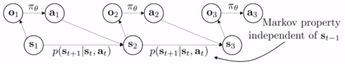
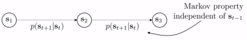
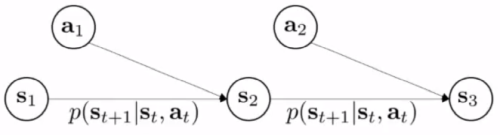
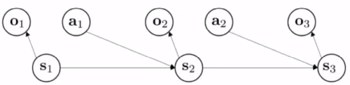
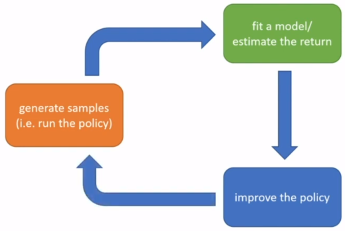
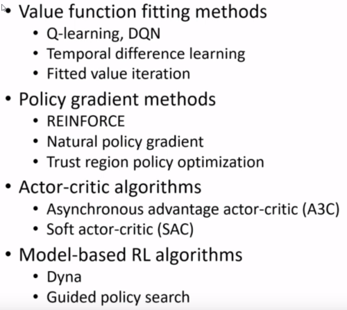

# [@](./README.md) Lecture 4: Introduction to Reinforcement Learning

**Today**: high-level overview of RL methods.

1. Definition of a MDP
2. Definition of RL problem
3. Anatomy of a RL algorithm
4. Brief overview of RL algorithm types

## 1. Definitions

### Terminology and notation

**Remark**: some RL methods do handle partial observability, some others do not.

**Remark**: you cannot just take the greedy action wrt to the reward, you have to think about what will be the rewards in the future.

### Markov chain

-  - state space
-  - transition operator

>Transition "operator" since it is a linear operator that apply to vector of probabilities : 
>
>-  -  is a vector of probabilites, summing to 1.
>- 
>
>Then .

Markov property:  is independent of .

### Markov Decision Process

MDP:  

with:

-  - state space
-  - action space
-  - transition operator (now a tensor)

>-  
>-  
>- 
>
>Then .

-  - reward function .

### Partially Observed MDP

POMDP:  

with:

-  - state space
-  - action space
-  - observation space
-  - transition operator (like before)
-  - emission probability .
-  - reward function.

Note that observations are independent given the states.

## 2. The reinforcement learning problem

### The goal of reinforcement learning

Produce a policy  (let's come back to POMDP later).

Probability of a trajectory, using the graphical model: 

Optimization problem (expected reward): 

### MDP to Markov chain

Given a policy , we can turn our MDP into a Markov *chain* by grouping states and actions together:

The transition probability of this Markov chain is:

We can write our optimization objective using the *state-action* marginal :

### Infinite horizon: stationary distribution thanks to ergodicity

We divide our optimization objective by , so as we may obtain something *finite* when  goes to infinity: 

Under **ergodicity** assumption (roughly speaking, every  is reachable from every  with non-zero probability),
  converges to a *stationary* distribution .
 
This means that our optimization problem becomes, in the limite :

### Expectations

In RL, we often we deal with **expected** reward. 

In particular, even if the reward is not smooth, its expectation with respect to the trajectories of a policy can be smooth in . 

Note that we can explicit our expecations over trajectories (using Markov property):

 

## 3. Anatomy of a reinforcement learning algorithm

Each block can be trivial or expensive, depending of the situation.

### Q-function 

Q for quality. 

 is the total expected reward from taking  in .

In RL, we will try to estimate this quantity.

Value function: 

### Using Q function 

Idea 1 (q-learning like): if we have a policy  and we know , then we can *improve* , by choosing actions with high q-value. 

Idea 2 (actor-critic like): compute gradient wrt  to increase probability of good actions . A good action is such that .

### Types of RL algorithms

+ Policy gradients: directly differentiate wrt  the objective (expected total reward).
+ Value-based: estimate V or Q of the optimal policy (no explicit policy).
+ Actor-critic: estimate V or Q of the current policy, use it to improve the policy (kind of combination of the first two).
+ Model-based RL: estimate the transition model...
	- Use it for planning
	- Use it to improve a policy
	- Something else
	
	
### Tradeoffs (why so many RL algorithms?)

- Different tradeoffs
	- Sample efficiency (off policy?)
	- Stability and ease of use 
- Different assumptions 
	- Full observability?
	- Stochastic or deterministic?
	- Continuous or discrete?
	- Episodic or infinite horizon?
- Different things are easy or hard in different settings
	- Easier to represent the policy? 
	- Easier to represent the model? 

	
### Examples

