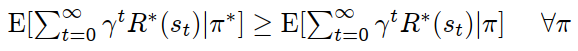
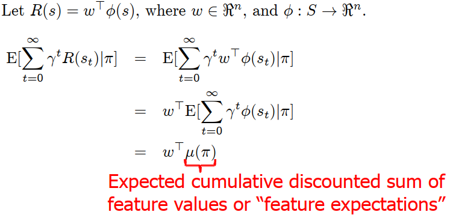
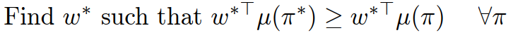
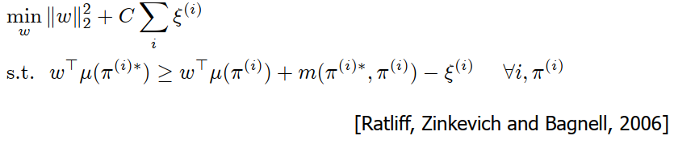
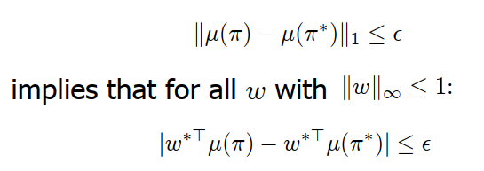
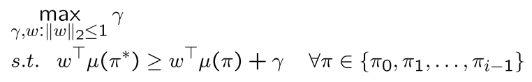
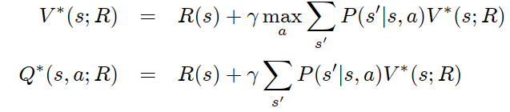
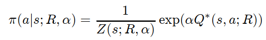
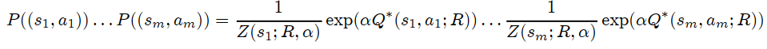

# Summary of [Inverse Reinforcement Learning](https://people.eecs.berkeley.edu/~pabbeel/cs287-fa12/slides/inverseRL.pdf) by Pieter Abbeel

## Background
* **Inverse RL**: Can we recover *R* ? 
* **Apprenticeship learning via inverse RL**: Can we then use this *R* to find a good policy?
* **Behavioral Cloning**: Can we directly learn the teacher's policy using supervised learning?  

## Three broad categories of formalizations
* Max margin
* Feature expectation matching
* Interpret reward function as parameterization of a policy

## Basic principle
Assume the expert is optimal and find a reward function which explains the expert behavior. i.e find *R** such that

## Feature based reward function

Then, finding *R** becomes:

 

#### Challenges
* Estimate expert feature expectations (from trajectories for example)
* Reward function ambiguity: expert is optimal under an many different reward functions (*R**=0 is always a solution)
* Assumes that the expert is optimal (is even more a issue with limited reward function expressiveness)
* Computational: assumes we can enumerate all policies

### Complete max-margin formulation
 

index  is generalization on different MDP (or same MDP with different initial states)

#### Resolves
* access to  by estimating it from trajectories
* ambiguity with structured prediction = number of states in which  was observed and in which
 and  disagree
* expert suboptimality: use of slack variable 

#### Remaining challenges
Very large number of constraints: use subgradients methods or constraint generation

### Feature matching
 

#### Apprenticeship learning [Abbeel & Ng, 2004](https://ai.stanford.edu/~ang/papers/icml04-apprentice.pdf)

Finds optimal policy and reward function. 
If suboptimal expert case:
* matches expert by stochastically mixing between the policies
* in practice if for any  one of  outperforms  then pick one of them. 
* for k-dimensional feature space the user picks between k+1 policies.

**Problem:**
 at each algo step  we must guess the reward function
 
 
  and then **find the optimal control policy** 

Other solutions if suboptimal expert:
* Min-Max feature expectation matching
* Maximum-entropy feature expectation matching

### Reward function parameterizing the policy class
Recall :

 

Assumes:

Then for any  and  we can evaluate the likelihood state action-pairs along a trajectory with:

