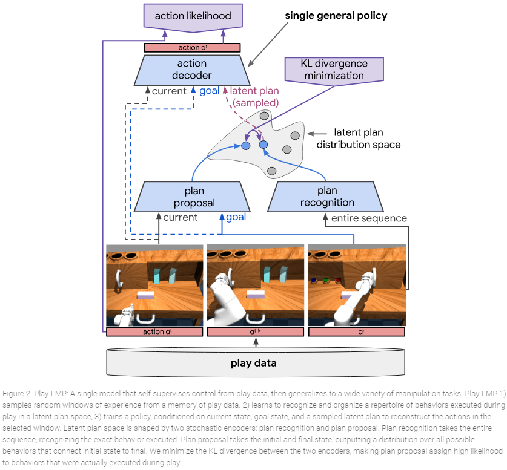
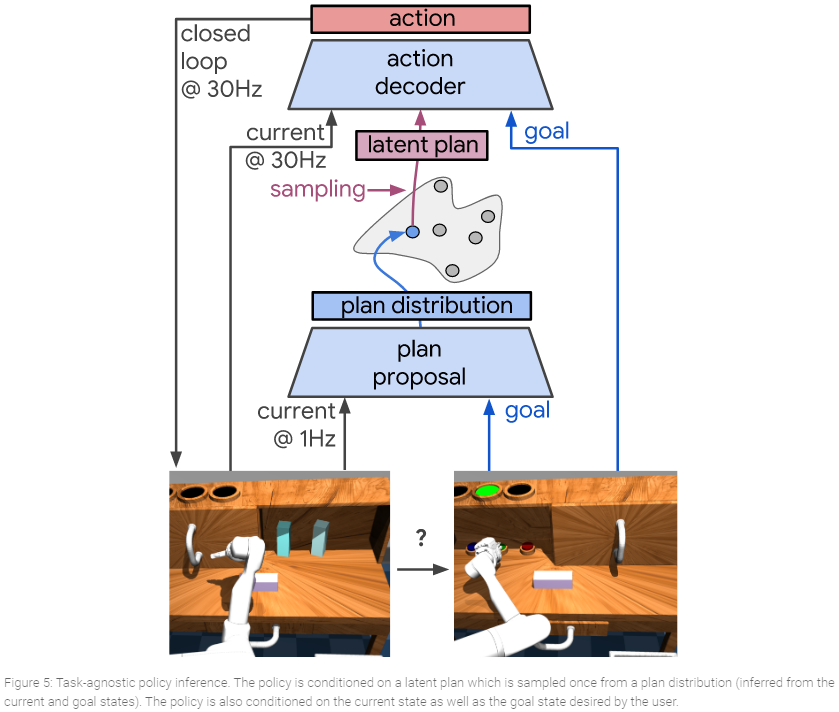
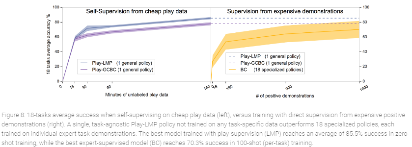
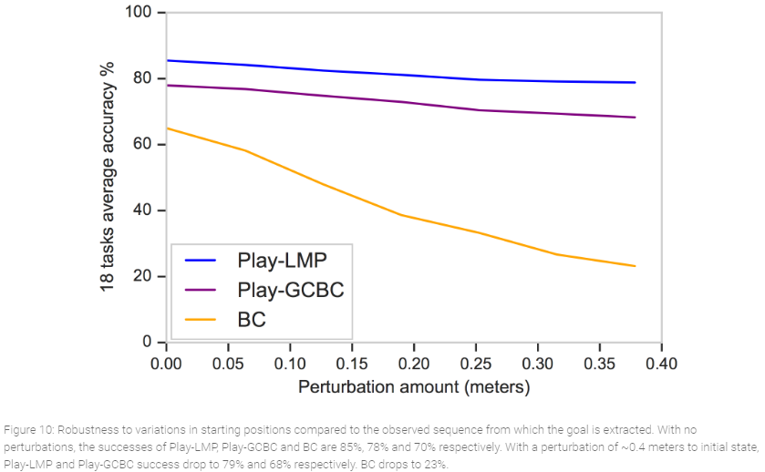
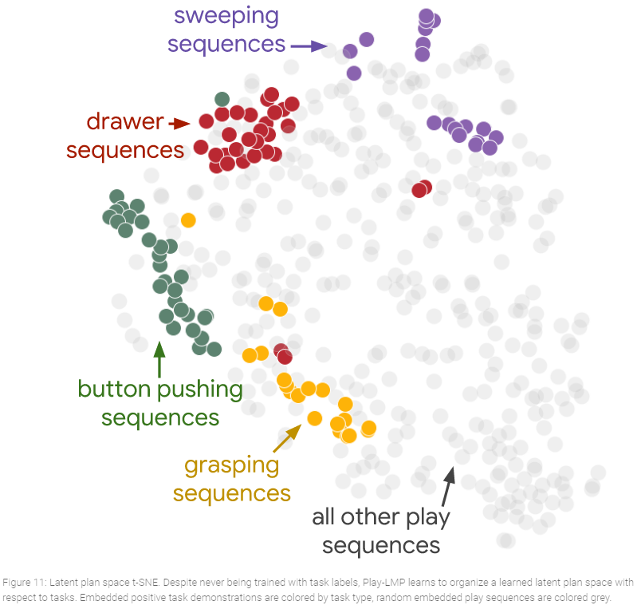

# Summary of [Learning Latent Plans from Play](https://arxiv.org/pdf/1903.01973.pdf) by Lynch et al.

## Idea
They use play data (an operator is teleoperating a robotic arm for 3h with no precise goal) to do self-supervised learning
and learn the sequence of actions that get the agent from a given state  to a goal state . 
Then they can do multi-task control by providing the current state of the robot and the desired goal state. 

They explicitly learn a latent representation of the possible plans (sequence of actions) that go from  to .
By doing this they can handle the multi-modality present in each task (many ways to reach the same goal).  

## Specifics
The sequence encoder that learns the latent plans representation is a bi-directional RNN. The policy is a RNN. 

## Limitations
"Like other methods training goal-conditionned policies, we assume that tasks important to a user can be described
using a single goal state". Not really adapted for adversarial tasks where the agent does have control over the whole
state and must react/re-plan depending on the adversaries actions. 

## Relevance to project
Our "plans" are influenced by the other agents and change dynamically. We cannot ensure that our plan stays constant over
a trajectory.

We might be more interested in something like Play-GCBC that is less effective but where there is no explicit latent plan
inference.
## Overview
### Architecture 
#### Training
<figure>
  
</figure>

#### Evaluating
 
 
### Results
#### Asymptotic Performance:
 
 
#### Robustness
 

#### Latent Plans
 